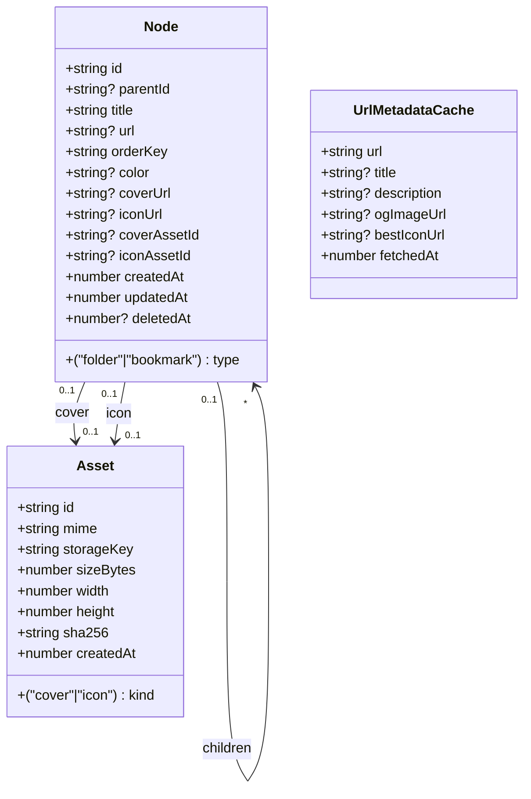
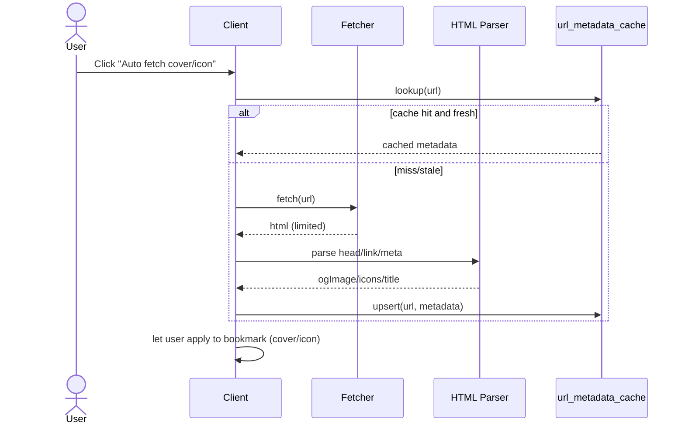

# AuraBookmarks 02 Design（系统设计文档）

> 本文是 `spec/requirements.md` 的“可实现化”设计：给出系统架构、数据模型、接口定义、关键流程与图表（Mermaid）。  
> 目标：让实现时“按图施工”，并确保前端项目可落地可维护。

## 0. 设计原则与范围

### 0.1 设计原则

- **文件管理器交互优先**：选择/多选/拖拽/重命名/快捷键规则一致，且在网格/列表/侧边树三处行为统一。
- **自有书签库为主**：v1 默认维护 AuraBookmarks 自有节点树（稳定 ID + 增强元数据），通过导入/导出与浏览器互通。
- **前端项目优先**：当前为单前端应用，不打包为浏览器扩展。
- **数据本地化**：默认 LocalStorage；可选 D1/SQLite 作为持久层。
- **元信息抓取**：当前可前端直抓，后续可切换为服务端抓取以避免 CORS/SSRF 风险。
- **UI 技术选型**：组件库统一使用 **HeroUI**，图标统一使用 **Iconify**。
- **视觉一致性**：UI 风格需复刻 `@refer` 目录原型的配色、间距与布局风格，作为设计基准。
- **工程指引**：前端实现前通过 **Context7 MCP** 查询库文档；性能与可访问性参考 **`vercel-react-best-practices`** 与 **`web-design-guidelines`**。

### 0.2 本阶段输出

- 组件/数据流架构图
- 数据库表结构（SQLite 版本为主）
- 存储接口契约（Storage Adapter）
- 关键流程设计：移动/排序、导入/导出 HTML、封面/图标抓取

## 1. 总体架构

### 1.1 组件视图（Component Diagram）

```mermaid
flowchart LR
  subgraph APP[Frontend App (Vite + React)]
    UI[App UI]
    STORE[Storage Adapter]
  end

  subgraph DATA[Data Layer]
    LS[(LocalStorage)]
    DB[(D1/SQLite)\n(optional)]
    CACHE[(UrlMetadataCache)\n(optional)]
  end

  UI <---> STORE
  STORE <---> LS
  STORE <---> DB
  STORE <---> CACHE
```

### 1.2 运行形态

- **单前端应用（Vite + React）**：作为唯一运行形态（完整体验、设置、导入导出）。
- **数据层**：LocalStorage 默认；如需更大规模可接 D1/SQLite（可选）。

## 2. 领域模型（Domain Model）

### 2.1 领域对象



### 2.2 关键约束

- `Node.type = bookmark` 时必须有 `url`；`folder` 时必须无 `url`（或忽略）。
- `parentId` + `orderKey` 决定同层排序。
- 移动节点时必须做 **循环检测**：禁止把文件夹移动到自身或其后代。
- 软删除（`deletedAt`）建议 v1 即支持（便于误删恢复/审计）；若不做回收站可后置，但数据结构预留。

## 3. 数据库设计（SQLite / D1 可选）

### 3.1 表结构（SQLite 参考）

> D1 为 SQLite：字段类型以 SQLite 约定为准；时间建议用 `INTEGER`（ms 或 s 统一一个单位）。

```sql
CREATE TABLE IF NOT EXISTS assets (
  id TEXT PRIMARY KEY,
  kind TEXT NOT NULL CHECK (kind IN ('cover','icon')),
  mime TEXT NOT NULL,
  storage_key TEXT NOT NULL,
  size_bytes INTEGER NOT NULL,
  width INTEGER,
  height INTEGER,
  sha256 TEXT,
  created_at INTEGER NOT NULL
);

CREATE TABLE IF NOT EXISTS nodes (
  id TEXT PRIMARY KEY,
  type TEXT NOT NULL CHECK (type IN ('folder','bookmark')),
  parent_id TEXT,
  title TEXT NOT NULL,
  url TEXT,
  order_key TEXT NOT NULL,
  color TEXT,
  cover_url TEXT,
  icon_url TEXT,
  cover_asset_id TEXT,
  icon_asset_id TEXT,
  created_at INTEGER NOT NULL,
  updated_at INTEGER NOT NULL,
  deleted_at INTEGER,
  FOREIGN KEY (parent_id) REFERENCES nodes(id),
  FOREIGN KEY (cover_asset_id) REFERENCES assets(id),
  FOREIGN KEY (icon_asset_id) REFERENCES assets(id)
);

CREATE INDEX IF NOT EXISTS idx_nodes_parent_order
  ON nodes(parent_id, order_key);
CREATE INDEX IF NOT EXISTS idx_nodes_title
  ON nodes(title);
CREATE INDEX IF NOT EXISTS idx_nodes_url
  ON nodes(url);

CREATE TABLE IF NOT EXISTS url_metadata_cache (
  url TEXT PRIMARY KEY,
  title TEXT,
  description TEXT,
  og_image_url TEXT,
  best_icon_url TEXT,
  fetched_at INTEGER NOT NULL
);
```

### 3.2 本地存储（LocalStorage）注意点

- 建议按 `nodes[]`, `assets[]`, `metadataCache[]` 结构化序列化
- 增加 schema version，避免未来升级破坏数据

## 4. 排序与移动（orderKey）

### 4.1 目标

- 同层可快速插入/移动（无需频繁重排全表）
- 可稳定比较（字符串排序即可）

### 4.2 推荐方案：Fractional Index / LexoRank（TEXT）

- `orderKey` 为可比较字符串。
- 插入位置：
  - 放到头部：`between("", firstKey)`
  - 放到尾部：`between(lastKey, "")`
  - 插入中间：`between(prevKey, nextKey)`
- 当两 key 过近无法再插入：触发 **局部重排**（只重排该父目录下的子节点）。

> 实现上可选：引入轻量 rank 库，或自行实现 `between(a,b)`（base62/字典序）。

### 4.3 循环检测（Folder Move Safety）

移动前校验：

- `targetParentId !== movingId`
- 若 moving 节点是 folder：`targetParentId` 不能是其任何后代

实现建议：

- DB 查询法（适合 D1）：从 `targetParentId` 向上爬父链，若遇到 `movingId` 则拒绝。
- 内存树法：客户端已有树时可先本地预判，最终仍以服务端校验为准。

## 5. 本地存储接口设计（Storage Adapter）

> 当前版本不引入后端 API，统一通过本地存储适配层实现 CRUD、导入导出与元信息抓取。

### 5.1 Node CRUD

#### `listNodes(parentId)`

返回当前父节点的子节点（按 `orderKey`）。

Response（示例）：

```ts
type NodeDTO = {
  id: string;
  type: "folder" | "bookmark";
  parentId: string | null;
  title: string;
  url?: string;
  orderKey: string;
  color?: string;
  coverUrl?: string;
  iconUrl?: string;
  createdAt: number;
  updatedAt: number;
};
```

#### `createNode(payload)`

Request：

```ts
type CreateNodeRequest =
  | { type: "folder"; parentId: string; title: string; }
  | { type: "bookmark"; parentId: string; title: string; url: string; };
```

#### `updateNode(id, patch)`

允许更新：

- `title`
- `url`（bookmark）
- `color`
- `coverUrl` / `coverAssetId`
- `iconUrl` / `iconAssetId`

#### `moveNodes(nodeIds, toParentId, beforeId?, afterId?)`

支持批量移动/排序（多选拖拽/批量操作核心）。

Request：

```ts
type MoveNodesRequest = {
  nodeIds: string[];
  toParentId: string;
  // 插入点（至少支持一种）
  beforeId?: string; // 插到某节点之前
  afterId?: string;  // 插到某节点之后
};
```

服务端职责：

- 校验权限 + 循环
- 计算每个节点的新 `orderKey`
- 事务内更新 `parentId` 与 `orderKey`

#### `deleteNodes(nodeIds)`

Request：

```ts
type DeleteNodesRequest = { nodeIds: string[]; hard?: boolean; };
```

### 5.2 Import / Export（HTML）

#### `importHtml(files, targetParentId)`

- `multipart/form-data`
- 字段：
  - `files[]`: 多个 HTML 文件
  - `targetParentId`: 导入目标文件夹（当前/指定路径）
  - `mode`: 固定 `folder-per-file`（v1）

行为：

- **每个 HTML 文件作为一个文件夹导入**：在 `targetParentId` 下创建 `importRootFolder`（默认名=文件名），并将解析出的层级写入其下。

Response：

```ts
type ImportHtmlResponse = {
  jobs: Array<{
    fileName: string;
    importRootId: string;
    created: number;
    skipped: number;
    errors: string[];
  }>;
};
```

#### `exportHtml(scope, folderId?, nodeIds?)`

参数：

- `scope=all|folder|selection`
- `folderId=...`（scope=folder）
- `nodeIds=...`（scope=selection）

返回：`text/html` 下载。

### 5.3 Metadata Fetch

#### `fetchMetadata(url)`

Request：

```ts
type MetadataRequest = { url: string; };
```

Response：

```ts
type MetadataResponse = {
  url: string;
  title?: string;
  description?: string;
  ogImageUrl?: string;
  icons: Array<{ url: string; sizes?: string; type?: string; rel?: string }>;
  bestIconUrl?: string;
};
```

## 6. HTML 导入/导出实现要点

### 6.1 HTML 解析（Netscape Bookmark Format）

解析目标：

- `DL/DT/H3` 表示文件夹（标题在 `H3`）
- `DL/DT/A` 表示书签（标题为文本，URL 在 `HREF`）

实现建议：

- 解析库：`parse5`（通用、可跑在浏览器）或等价轻量 HTML parser
- 输出：中间 AST（`ImportFolder`/`ImportBookmark`）再转换成 `Node` 批量写入

写入策略（重要）：

- 对每个 HTML 文件：
  1. 创建 `importRootFolder`（位于 `targetParentId`）
  2. 深度优先写入子节点（可在内存先生成全部 id，再批量 insert）
  3. 同一父节点下按 HTML 顺序分配 `orderKey`
  4. 事务提交

### 6.2 HTML 导出

- 以选定节点生成 Netscape 格式
- 文件夹输出 `<H3>` + 内部 `<DL>`；书签输出 `<A HREF="...">`
- title/url 需要 HTML 转义

## 7. 封面/图标抓取（服务端）

### 7.1 安全与稳定（必须）

- 只允许 `http/https` URL
- 限制重定向次数（<= 3）
- 限制响应体大小（例如 1–2MB，用于解析 head/links 足够）
- 超时（例如 5s）与并发限制
- SSRF 防护：拒绝私网/本机地址（`127.0.0.1`、`10.0.0.0/8`、`169.254.0.0/16`、`192.168.0.0/16` 等）

### 7.2 抓取流程（Sequence）



## 8. 前端状态与交互实现建议（前端通用）

### 8.1 状态切分

- `navigation`: `currentFolderId`, breadcrumbs
- `selection`: 选中集合 + 锚点（用于 shift 范围）
- `ui`: sidebar/inspector open, viewMode, theme, locale
- `data`: 当前 folder 子节点分页/虚拟列表数据

### 8.2 组件拆分（建议）

- UI 基础组件：HeroUI（Button/Input/Dropdown/Modal 等）+ Iconify 图标
- `FolderTree`（左侧栏）+ `FolderTreeItem`
- `Toolbar`（新建/导入导出/视图切换/主题语言）
- `ItemGrid` / `ItemList`（虚拟滚动）
- `InlineRename`（F2/Enter/Esc）
- `Inspector`（属性编辑：颜色/封面/图标/URL）

### 8.3 拖拽库

推荐 `@dnd-kit`（React 生态成熟，支持 sortable + 多选协同）。

## 9. 运行形态（无扩展）

- 当前仅前端项目，不包含 MV3 扩展结构
- 打开书签：`window.open(url, "_blank")`

## 10. 测试策略（设计层）

- 单元测试（`packages/core`）：
  - `orderKey` 生成与重排
  - 移动循环检测（父链爬升）
  - HTML 导入解析（多文件、深层级、异常 HTML）
  - HTML 导出再导入一致性（快照）
- 集成测试：
  - LocalStorage 读写一致性
  - import 事务性（错误回滚）
- E2E（前端）：
  - 新建/重命名/拖拽排序/多选删除/导入导出/主题语言切换

## 11. 待决策（需要在落地前确认）

1. 存储优先级：LocalStorage（默认）还是 D1/SQLite（增强）？是否需要双实现？
2. 资源存储：DB Blob（早期）vs 本地缓存（上线后再定）
3. 元信息抓取：前端直抓 vs 后端服务（安全与 CORS 取舍）
